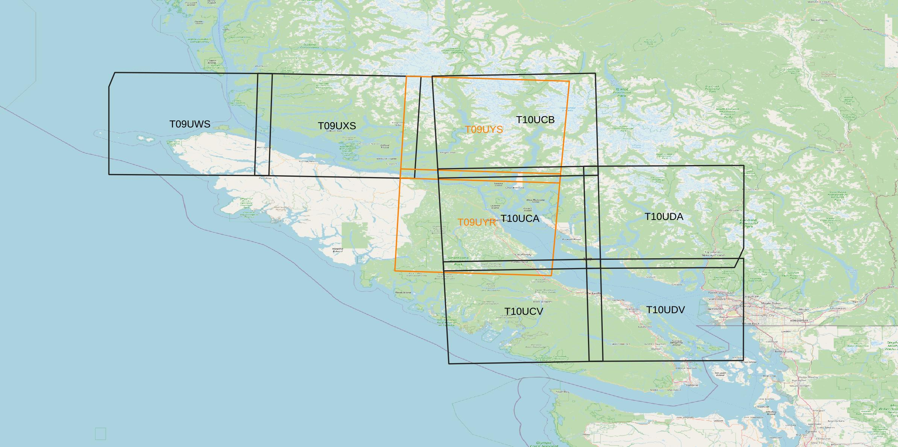

Readme coming soon!!!
Run the main python file.

# Requirements
### 1. 
- PyQGIS
- gdal
- numpy
- pandas
- PIL

# 1. Bathymetry Surface
The following files will be executed for this step:
### 1.1 qgis_selectDB_jobs
A "project" directory must be created. The path of this "project" directory with the directories path of "geojson", "rivers" and 
"map.jpg" (which are inside of this package) must be defined in this file ("project_path", "geojson_path", "river_path" and "map_dir"). 

Based on Sentinel-2 tile name, the interested region must be selected.

Inside the "project" directory, a new directory will be created ("SurBat_yyyymmdd-hhmm").
The program needs the date of bathymetry data which use in "ApiCsbBathy" file [1.2. ApiCsbBathy](#12-apiCsbBathy). Based on the selected region, 
minimum and maximum extent of its 
geojson file is detected.

### 1.2. ApiCsbBathy
To connect to API, the "username" (access_email) and "password" (access_key) must be entered. It also needs: 

- bathymetry "date" (year, month, day) 
- "hour" and "minute" (the default is zero. It means that for whole day) 
- "data interval" (timeDiff) which must be in "hour". (e.g. for one month data interval is 720). 
- "maxDepth" (the default is zero. It means all depths)

This program detects all data by using geojson extent (ymin_tile, ymax_tile, xmin_tile, xmax_tile) and above information and the result
"NNNNNN_DDDDDDDD_YYYYMMDD.csv" file is saved in project directory (beside "SurBat_yyyymmdd_hhmm" directory). 
- NNNNNN: Sentinel-2 tile name
- DDDDDDDD: Date of running program
- YYYYMMDD: year, month and day that entered for bathymetry data

The ds

### 1.3 readCSVfromAPI
### 1.4 SentinelAquisition

# 2. Satellite-Derived Bathymetry (CIDCO)

# 3. Satellite-Derived Bathymetry (ESA-SNAP)

# 4. SDBs Integration with Regional DEM
